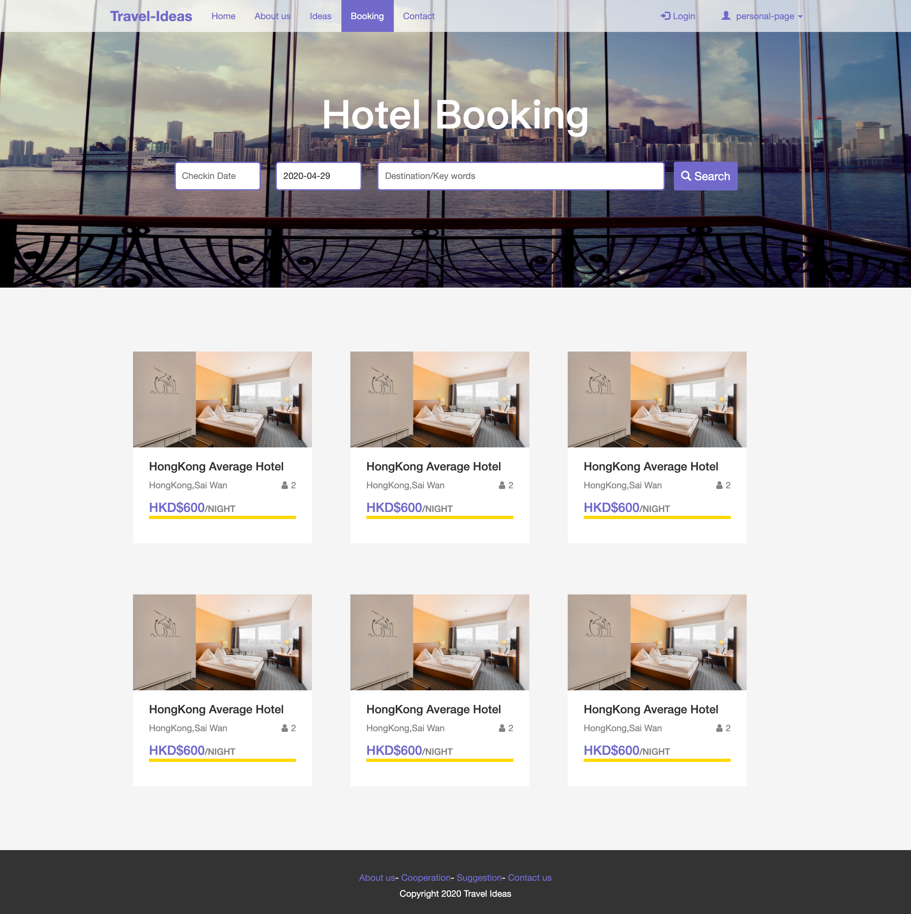

# Travel's idea-share webiste（旅游攻略分享）

一个用于分享旅游攻略或者查找旅游攻略的网站，这个网站还兼具了酒店搜索和预定功能。这是一个纯前端的简单的页面设计和实现。这个网站有点类似于社区博客，可以评论，发表管理自己的发表。   
英文版的README: Enlish version of README.md, see [here](https://github.com/Kexin-ya/travel-idea-share) . 

## 使用方法

**下载: Download** [here](https://github.com/Kexin-ya/travel-idea-share/releases/tag/1.0) 
在浏览器中打开 `index.html` 文件即可。

项目中的  `travel_css.css` 是自定义的样式表。

## 语言和框架

HTML5, CSS3, JS 

Bootstrap, jQuery

## 详细介绍

#### 1. 首页 - Index page 

-----

网站的首页。

.png)

#### 2. 所有攻略页面 - All travle idea page

------

可以根据不同的需求搜索你想要的攻略。

#### 3. 酒店搜索页面 - Booking recomendations 

-------

可以根据入住和退房的时间以及目的地搜索酒店，点击酒店信息可以直接预定。

#### 4. 攻略详情页面 - Detailed idea page -- with comment function 

----

"My trip route" 这个位置是用于放置一些地图类的API，底下有评论功能，可以对攻略进行评论和留言。

#### 5. 个人攻略管理 - My travel idea page -- personal travel idea page 

----

页面可以管理自己发表的攻略。可以查看，删除，新增新的发表。

#### 6. 个人酒店订单页面 - My booking order page -- personal hotel booking page

------

可以管理自己的酒店订单。

#### 7. 攻略/酒店预定订单 信息填写页面 - Idea and order created page

------

----

## 备注

所有的图片都来源于Flickr。请勿商用。

